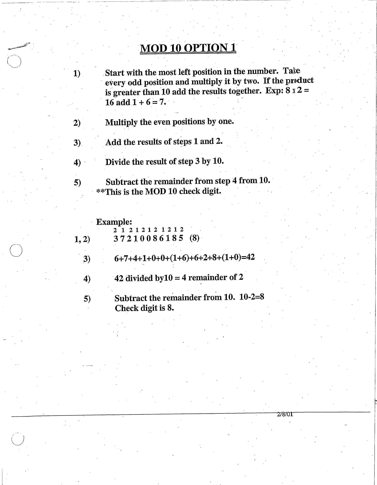

# PolyRents
Resource checkout system for the OCOB helpdesk.

## Class Diagram


## Component Diagram


## ER Diagram


## Check Digit Algorithm explained



```java
public int calculateCheckDigit()
{
    int sum = 0;

    int stepNum = 0;

    for (int i = 0; i < libNumber.Length; i++)
    {
        stepNum = int.Parse(libNumber.Substring(i, 1));
        
        //Odd position work
        if (i % 2 == 0)
        {
            stepNum = stepNum * 2;

            // add the digits together if it is greater than 9
            stepNum = stepNum > 9 ? stepNum / 10 + stepNum % 10 : stepNum;
        }

        sum += stepNum;
    }

    return 10 - sum % 10;
}
```
